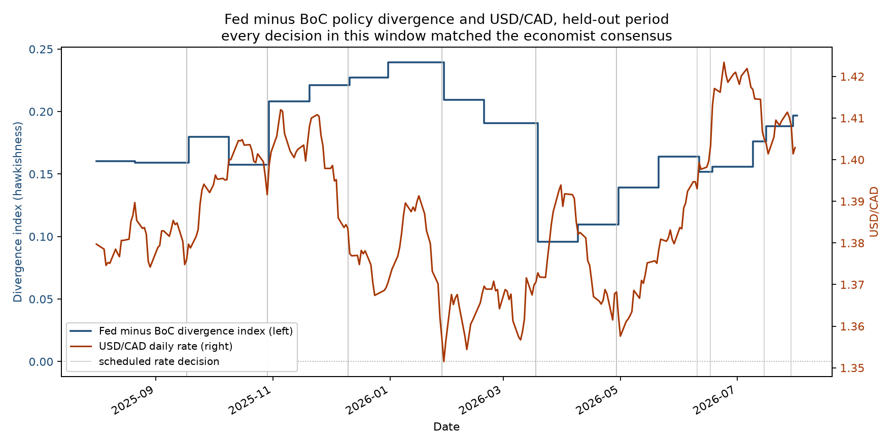

# cbsent

A hawkish-dovish sentiment engine for Federal Reserve and Bank of Canada
communications. Sentence-level stance and topic from a fine-tuned
DistilBERT, evaluated against the dictionary method from the literature
and zero-shot GPT-5 on a chronologically held-out year, and validated
with a point-in-time event study against USD/CAD.

This is a library, not a hosted app: an importable package, a CLI, and
scripts that reproduce every number reported in
[RESULTS.md](RESULTS.md).

## Install

```bash
pip install -e ".[model]"     # scoring
pip install -e ".[research]"  # scoring plus everything RESULTS.md needs
```

Bare `pip install -e .` installs only the ingest and segmentation layer,
which is deliberately free of PyTorch.

## Use

```python
from cbsent import score

result = score("Inflation remains elevated, and it is not yet appropriate to lower the target range.")
print(result["score"], result["stance"])
# 0.9996 hawkish
```

The negated cut in that sentence is read as hawkish, not dovish. Weights
are found at `export/cbsent`, or set `CBSENT_HUB_REPO` to pull them from
the Hugging Face Hub; the `distilbert-base-uncased` backbone is fetched
from the Hub the first time a model loads.

From the shell:

```bash
cbsent score statement.txt
cbsent segment statement.txt
```

## What it does

```
official sites          release timestamps        stance + topic          index
-------------           -----------------         --------------          -----
FOMC statements    -->  documents table      -->  DistilBERT        -->   Fed level
FOMC minutes            (published_at)            two heads:              minus
BoC announcements  -->  sentences table      -->  stance 3-class    -->   BoC level
                        (published_at)            topic 5-class           = divergence
```

Every document is stamped with its exact release time (FOMC 2:00 p.m. ET;
BoC 10:00 a.m. ET before 2024-01-24, 9:45 a.m. ET after), and every
sentence row carries that timestamp. The divergence index at any instant
reads only sentences whose `published_at` precedes it, so look-ahead is a
schema violation rather than a code review question.

Sentence segmentation is tuned to central bank prose: decimal rates,
dotted abbreviations, enumerated clauses in minutes, and long
semicolon-chained sentences that each carry their own stance.

Negation and hedge cues are marked inline before encoding, so
"it is not yet appropriate to raise rates" is not read as hawkish. The
effect of that transform is measured, not asserted; the ablation is in
RESULTS.md.

## Evaluation

Chronological split only. Training uses text published before
2025-08-01; the year that follows is never seen during training or model
selection. All three systems are scored on the identical 595 held-out
sentences, on CPU.

| system | macro-F1 | hawkish F1 | dovish F1 | neutral F1 |
|---|---|---|---|---|
| dictionary (Apel & Blix Grimaldi) | 0.5794 | 0.4903 | 0.4217 | 0.8262 |
| zero-shot GPT-5 | 0.8208 | 0.7863 | 0.7615 | 0.9146 |
| cbsent (fine-tuned) | 0.6804 | 0.5429 | 0.6114 | 0.8868 |

**These numbers are provisional and the fine-tune does not beat GPT-5
here.** The reference labels for the held-out year currently come from an
LLM bootstrap pass, not from a human. That makes the comparison unfair in
GPT-5's favour: it shares a model family and a prompt with the labeller,
so its row measures agreement with its own family rather than accuracy.
The fine-tuned row is partly measured against its own training signal for
the same reason. The one comparison that means something today is the
margin over the dictionary baseline, which shares nothing with the
labeller: **+0.101 macro-F1**. Alongside that, the fine-tuned model runs
at 122 sentences/second locally at no marginal cost, against $2.46 per
1,000 sentences for GPT-5.

Turning this into a real headline number requires human-verified held-out
labels; the review queue exists for exactly that, and
[labeling/README.md](labeling/README.md) explains the priority order.

Every number above, the negation ablation, the event study, and the cost
comparison are in [RESULTS.md](RESULTS.md) with the command, git commit,
and date that produced each one.

## Event study



Point-in-time replay over the held-out year: for each of the 16 scheduled
Fed and BoC decisions, the divergence index is computed from text
published strictly before the release timestamp, then compared with the
USD/CAD move over the hour after the release (intraday ticks for all 16).

The honest result: **no decision in this window differed from the
economist consensus**, so there are zero surprises to test against. Across
all 15 decisions where the index change is defined, it moved in the same
direction as the pair on 9, which a two-sided binomial test cannot
distinguish from a coin flip (p = 0.607). The consensus source for every
decision is cited row by row in [data/decisions.csv](data/decisions.csv).

## Labeling

[labeling/codebook.md](labeling/codebook.md) defines the stance and topic
schemes, cites the literature they adapt, and gives worked
negation/hedge cases. Labels are bootstrapped with the dictionary method
plus an LLM pass, then human-reviewed through
[labeling/review.py](labeling/review.py); the review queue prioritizes
the held-out window and every bootstrap disagreement.

## Reproducibility

One command per reported number, each appending to RESULTS.md with the
command, the git commit, and the date:

```bash
make ingest        # scrape and load documents and sentences
make bootstrap     # dictionary + LLM first-pass labels
make review        # human review queue (make review-html for the browser)
make train         # fine-tune, chronological split, trains on Apple MPS
make ablate        # negation/hedge ablation across seeds
make eval          # the three-way macro-F1 table
make event-study   # decisions, FX alignment, and the chart
make cost          # inference cost and speed against the LLM baseline
make test          # unit tests
```

Every script that reports a number scores on CPU by default. This is
deliberate: MPS inference on this model is not deterministic, and the
same evaluation swung by about two macro-F1 points between repeats on
MPS while CPU repeats were exact. The measurement is in RESULTS.md.
Training still runs on MPS, where nondeterminism only perturbs the
optimisation path and the resulting weights are kept as an artefact.

Requires PostgreSQL (`DATABASE_URL`) and, for the LLM passes,
`OPENAI_API_KEY`. Pinned dependencies are in
[requirements.lock](requirements.lock). Data sources: the Federal
Reserve and Bank of Canada websites; USD/CAD from Dukascopy tick history
with the Bank of Canada Valet daily rate as fallback.

## License

MIT
